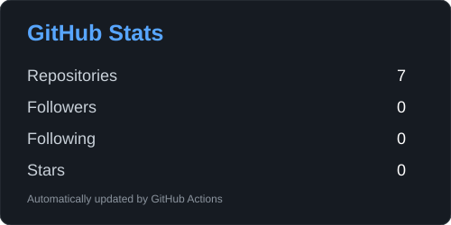

# Hi 👋, I'm Aditi Tiwari

### 💻 Computer Science & Engineering Student | Web Developer | Python Enthusiast

I'm a B.Tech Computer Science & Engineering student from **Lucknow, India**, passionate about building practical projects, learning new technologies, and exploring the world of software development.

I enjoy turning ideas into working applications and continuously improving my development skills through projects and open-source contributions.

---

## 🚀 About Me

* 🎓 B.Tech - Computer Science & Engineering
* 💻 Interested in **Web Development & Software Development**
* 🐍 Currently learning and building with **Python**
* 🌐 Exploring modern web technologies
* 🔥 Building projects to strengthen my development skills
* 🌱 Always learning something new
* 🤝 Interested in **Open Source & Collaboration**

---

## 🛠️ Tech Stack

### Languages


### Tools & Technologies


---

## 📌 Featured Projects

### 🐍 SnakeGame

A classic Snake game project created as part of my journey in learning programming and application development.

🔗 [View Project](https://github.com/aditittiwari1234/SnakeGame)

### 🧮 JavaScript Calculator

A simple calculator built using JavaScript to practice programming logic and DOM interaction.

🔗 [View Project](https://github.com/aditittiwari1234/java-script-calculator)

### 🛒 Kartify

Kartify is an e-commerce web app featuring product browsing, search/filter, cart, login, checkout, and order management.

🔗 [View Project](https://github.com/aditittiwari1234/Kartify)

---

## 📊 GitHub Stats

<p align="center">
  
  
</p>

## 🔥 Contribution Activity

<p align="center">
  
</p>

## 👀 Profile Views

<p align="center">
  
</p>

---

## 🌱 Currently Learning

```text
Web Development
Python
JavaScript
Data Structures & Algorithms
Open Source Development
Software Engineering
```

---

## 🎯 My Goals

* 🚀 Become a strong software developer
* 🌐 Build real-world web applications
* 🐍 Improve my Python development skills
* 🤝 Contribute to open-source projects
* 📚 Continuously learn new technologies
* 💡 Build projects that solve real problems

---

## 🤝 Let's Connect

I'm always interested in learning, collaborating, and working on interesting projects.

<p align="left">
  <a href="https://github.com/aditittiwari1234">
    
  </a>
</p>

---

<p align="center">
  <i>✨ Keep learning. Keep building. Keep growing. ✨</i>
</p>
